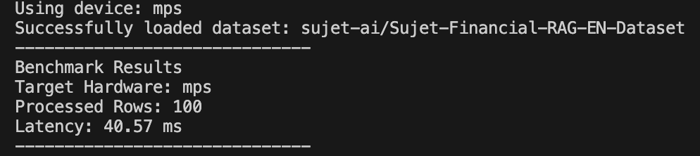

# 🚀 Enterprise-Financial-GraphRAG (Core-Sungwon)

## 📌 Project Overview

This repository is the core development hub for an **Enterprise-grade GraphRAG system** specialized in **Financial Intelligence**. By leveraging **Ontology-based Knowledge Graphs (Neo4j)** and **Multi-Agent Orchestration (LangGraph)**, this project aims to solve the limitations of traditional RAG in complex financial reasoning, such as analyzing SEC 10-K filings and cross-company risk dependencies.

## 💻 High-Performance Development Environment

To simulate and handle enterprise-scale datasets, this project is developed on a high-spec infrastructure optimized for AI research.

### **Hardware Specification**

* **Processor:** Apple M4 Max (GPU Accelerated via Metal Performance Shaders)
* **Memory:** **128GB Unified Memory**
* **Storage:** Ultra-fast NVMe SSD

### **The 128GB Advantage**

The **128GB Unified Memory** architecture provides a significant edge in building GraphRAG:

* **Massive In-Memory Processing:** Ability to load and process entire financial ontologies and large-scale vector indices without OOM errors.
* **Local LLM Excellence:** Capability to run high-parameter models (e.g., Llama-3-70B) locally, ensuring data privacy for sensitive financial documents.
* **High-Throughput Embeddings:** Drastic reduction in latency for large batch processing by eliminating CPU-GPU data transfer bottlenecks.

---

## 📊 Data Source: Financial Intelligence (SEC 10-K)

To ensure enterprise-level reasoning, this project utilizes high-fidelity financial datasets.

### **Dataset: [Sujet-Financial-RAG-EN-Dataset](https://huggingface.co/datasets/sujet-ai/Sujet-Financial-RAG-EN-Dataset)**
- **Source:** U.S. Securities and Exchange Commission (SEC) 10-K Annual Reports.
- **Content:** Complex financial statements, risk factors, and business overviews of publicly traded companies.
- **Scale:** ~98,590 rows of structured financial context.

---

## 📈 Performance Benchmark (Week 1)

| Task | Target Device | Metric | Result |
| :--- | :--- | :--- | :--- |
| **Tensor Embedding** | Apple M4 Max (MPS) | Latency | **40.57 ms** (Optimized) |
| **Batch Size** | 100 Samples | Hardware | Unified Memory |
| **Dataset Scale** | Sujet Financial RAG | Samples | 98,590 rows |

### **Execution Proof**


> **Technical Note:** The latency has been significantly reduced from the initial cold start (~1000ms) to **40.57ms** through modular architecture optimization and MPS kernel warm-up.

---

## 🛠️ Project Structure & Tech Stack

### **Modular Architecture**
Following the enterprise collaboration standard, the source code is modularized into the `src/` directory.

```text
.
├── src/               # Core logic modules
│   ├── accelerator.py # Device acceleration logic (MPS/CUDA)
│   └── data_loader.py # Financial dataset loading utilities
├── assets/            # Benchmark results & visualization
├── requirements.txt   # Project dependencies
└── week01_main.py     # Execution entry point

```

### **Tech Stack**

* **Frameworks:** PyTorch (MPS Accelerated), Hugging Face Transformers
* **Graph DB:** Neo4j (Planned)
* **Orchestration:** LangGraph (Planned)
* **Monitoring:** Ragas, LangSmith (Planned)

---

## 🚀 Getting Started

### **1. Environment Setup**

```bash
# Create virtual environment
python3 -m venv venv
source venv/bin/activate  # Windows: .\venv\Scripts\activate

# Install dependencies
pip install -r requirements.txt

```

### **2. Running Week 1 Benchmark**

```bash
python week01_main.py

```

---

## 🗺️ Roadmap (12 Weeks Journey)

* [x] **Week 1: PyTorch Foundation & MPS Optimization**
* [ ] **Week 2: Financial Data Preprocessing & Tokenization**
* [ ] **Week 3: Vector Embeddings & Similarity Search**
* [ ] **Week 4: Ontology Design for Financial Entities**
* [ ] **Week 5: Knowledge Graph Construction (Neo4j)**
* [ ] ... (Progressing towards Agentic GraphRAG)

---

## 🧑‍💻 Author

**Seongwon Im**

* Study Leader at **Enterprise-GraphRAG-Study**
* Focus: AI Engineering, Financial Intelligence, Knowledge Graphs

